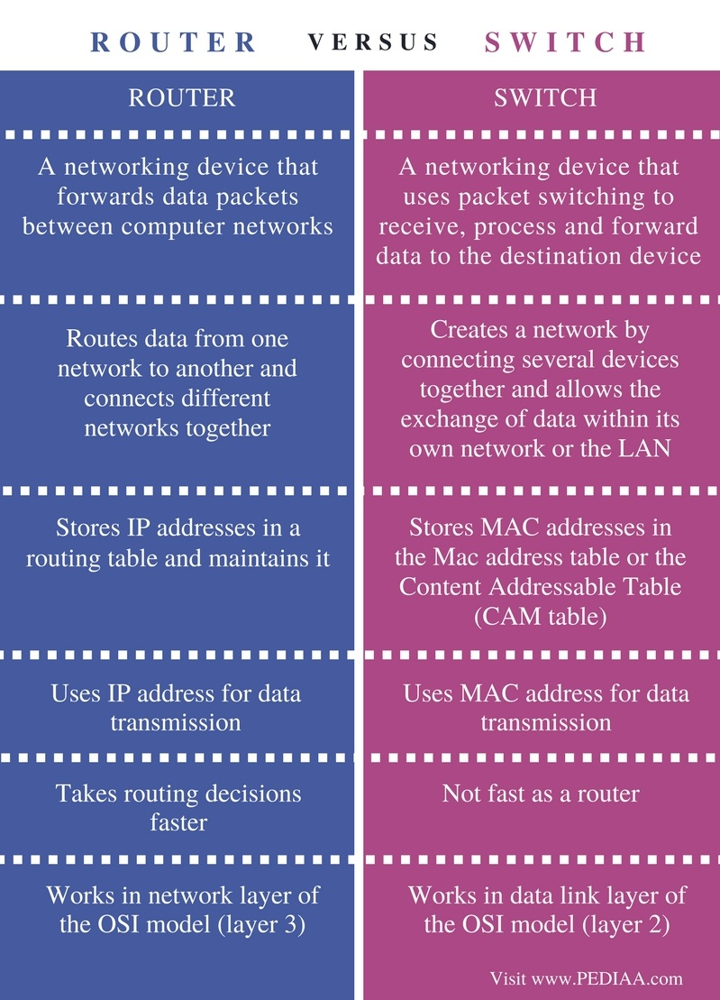
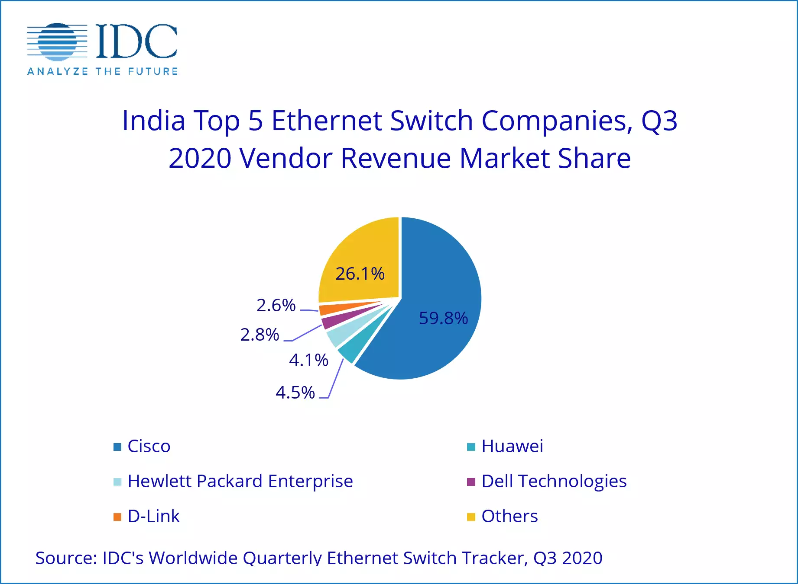
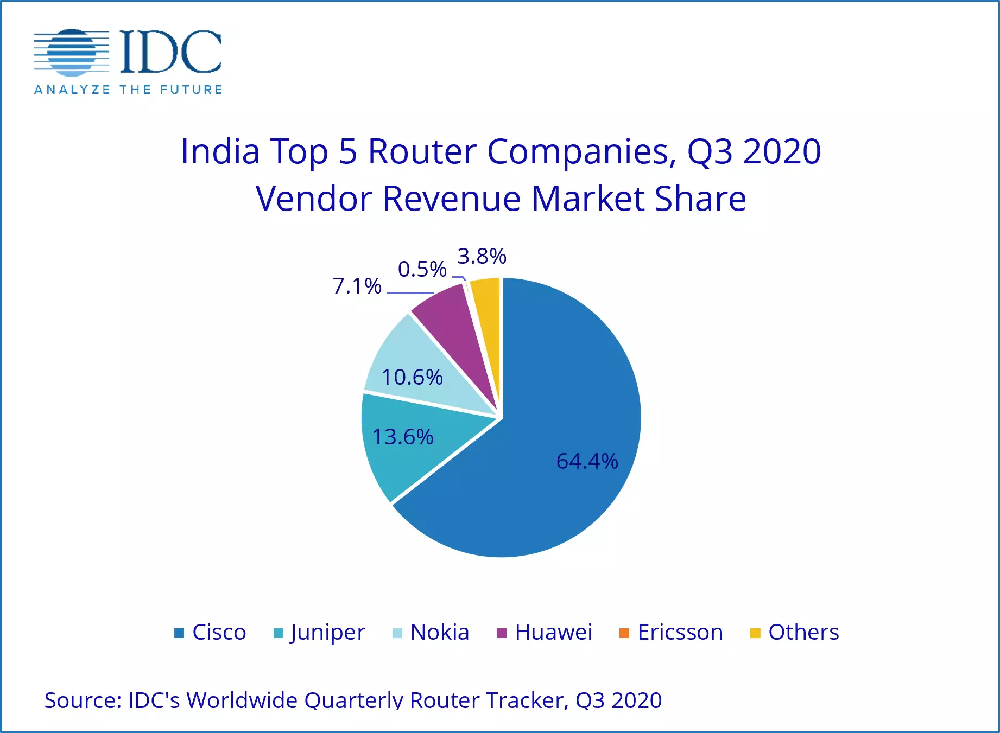
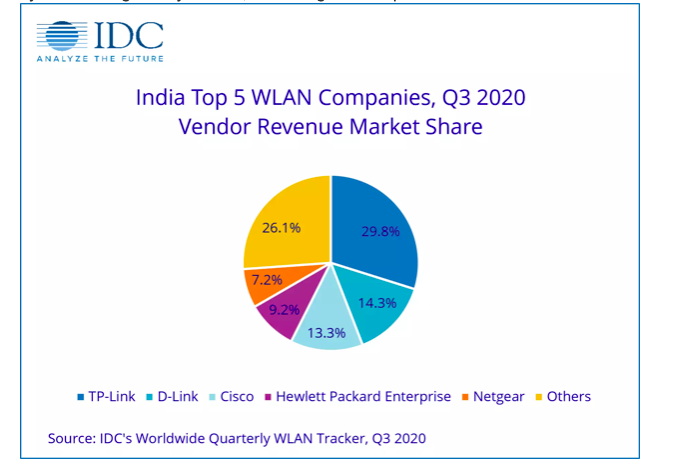

# Switch

* Switch facilitate the sharing of resource by connecting together all devices, including computers, printers, and servers, in a small business network.

* Connected device can share information.

### MODELS
- NETGEAR JGS524
- CISCO SG250-26P Smart Switch
- HUAWEI S5720-12TP-LI-AC-Switch

# Router

* Router connects mutliple switches, and their respective networks, to form an even larger network. These network may be in a single location or across multiple location.

* In addition to connecting multiple network together, the router also allows networked devices and mutliple users to access the Internet.

* Ultimately, a router works as a dispatcher, directing traffic and choosing the most efficient route for information, in the form of data packets, to travel accross the network. A router connects you business to world, protects information from security threats, and even decides which devices have priority over others.

### MODELS
- CISCO RV340 Dual WAN Gigabit Router
- D-Link DWR-920V
- NETGEAR Nighthawk AX6 6-stream Wi-fi 6 router

---

---

# Wireless Controller

* A WLAN is a wireless architecture that aims to meet changing network demands. A WLAN controller manages wireless network access points that allow wireless devices to connect to the network.

* First, an access point is a device that allows wireless devices to connect to it by means of antennas.

* A controlled access points works as a client of Wireless LAN Controller(WLC). Technically, a controlled access point is known as Lightweight Access Point  (LWAP).

* LWAP doesn't take any forwarding decisions, instead it forwards frame (A digital data transmission unit) to WLC.

* The WLC, based on the security configuration, makes decision whether the received frame should be forwarded or discarded

* If the frame needs to be forwarded, then it sends that frame to that LWAP, to which the destination device is connected. Then that LWAP sends this frame to the destination device.

* Since all forwarding decisions are taken by the WLC, an LWAP does not allow direct communication between the two devices, even if they both are connected with it.

* The WLC - LWAP setup is usually used in the company environment to span a single wireless network in large geographical area. This setup allows users to roam around the office premise, campus or building and stay connected to the network.

### MODELS
		- CISCO AIR-CT5508-K9
		- HUAWEI AC6605
		- NETGEAR WC7600v2
> A ROUTER CAN BE ACCESS POINT BUT AN ACCESS POINT CAN'T BE ROUTER **?**

---

> Ethernet Switches market value will reach 1.27B USD this year (projected).
>
>> Compound Annual Growth Rate of more than 11%(CAGR). 

> The wireless router market was valued at 10.5B USD in 2020.
>
>> at a CAGR of 8.4%.

	Top market vendors.
		- Cisco
		- HP enterprise
		- Huawei

---

# INDIAN MARKET DISTRIBUTION (3Q-2020)

---

---

---

# VLANs (Virtual Local Area Network)

* VLAN is a subnetwork which can group together collections of devices on separate physical local area networks (LANs). A LAN is a group of computers and devices that share a communications line or wireless link to a server within the same geographical area.

* VLANs make it easy for network administrators to partition a single switched network to match the functional and security requirements of their systems without having to run new cables or make major changes in their current network infrastructure.

* VLANs are often set up by larger businesses to re-partition devices for better traffic management.

# CLASS A, B and C subnets

---

---

##### Class A: First Octet value 0 - 126
##### Class B: First Octet value 128 - 191
##### Class C: First Octet value 192 - 233

### Class A

* This network is a 8-bit network prefix. It's highest bit is set 0, and contains a 7-bit network number and a 24-bit host number.

* The class A network address block contains 2 31 power (2,147,483,648) individual addresses. The IPv4 address space contains a maximum of 2 32 power (4,294,967,296) addresses, which mean that a class A network address space is 50% of the total IPv4 unicast, address space.

* Designed for the government and large institutions needing a great deal of unique nodes.

### Class B

* This network is a 16-bit network prefix; its highest bit order is set to 1-0. It is a 14-bit network number with a 16-bit host number.

* This class defines 16,384 (214 ) /16 networks, and supports a maximum of 65,534 (216 -2) hosts per network. Class B /16 block address is (1,073,741,824) = 230; therefore it represent 25% of the total IPV4.

*

### Class C

* This is a 24-bit network prefix; it has a 3 bit set to the highest order 1-1-0. It is a 21-bit network number with 8-bit host number.

* This class defines a maximum of 2,097,152 (221 ) /24 networks. And each network supports up to 254 (28 -2) hosts. The entire class C network represents 229 (536,870,912) addresses; therefore it is only 12.5 % of the total IPv4.
